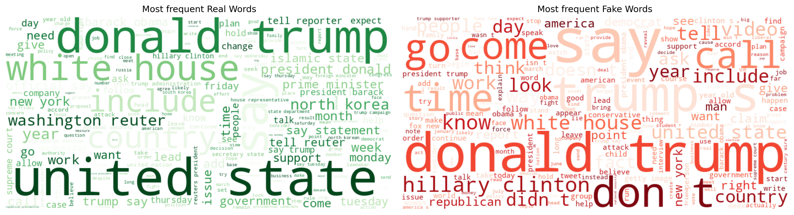
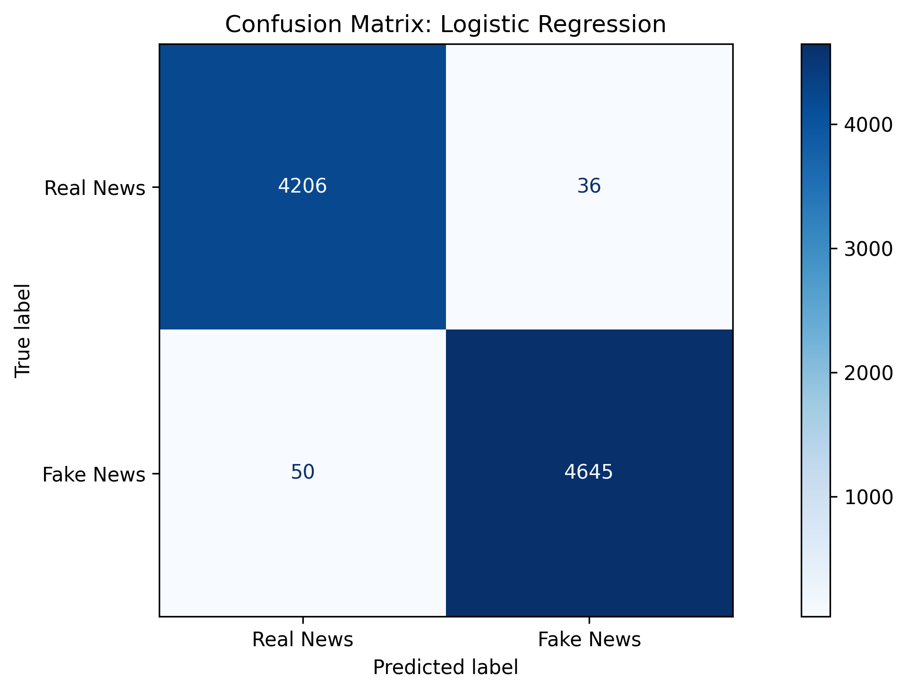
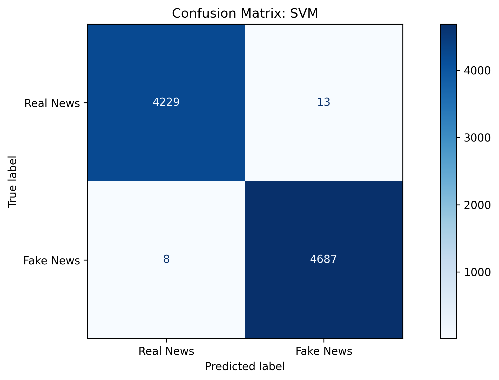
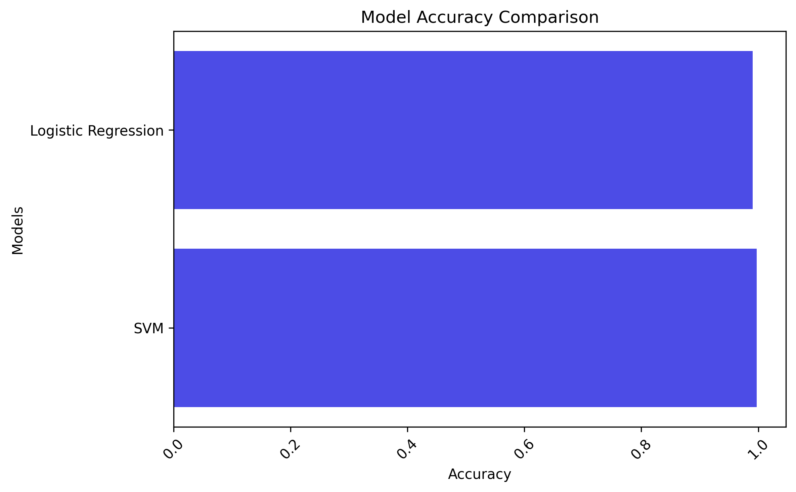

## 📰 Fake News Detection
This project is a **Natural Language Processing (NLP)** application designed to detect fake news by classifying news articles as **real** or **fake**.

## 🧩 Key Steps:
- Data Cleaning: Tokenization, stopword removal, lemmatization, et.c
- Feature Extraction: Converted text into numerical features using TF-IDF vectorization.
- Model Training: Trained and compared multiple models:
  - **Logistic Regression** 
  - **Support Vector Machine (SVM)**
- Visualization: Generated word clouds and confusion matrices for both models.
- Evaluation: Measured model accuracy, precision, recall, and F1-score.
- Deployment: Built a simple Streamlit app for interactive prediction.

## 📂 Dataset
The dataset used is the Fake and Real News Dataset (50,000+ samples).
- Available on:
  - [Kaggle - IMDb Dataset](https://www.kaggle.com/datasets/clmentbisaillon/fake-and-real-news-dataset)
  - [Google Drive - IMDb Dataset](https://drive.google.com/drive/folders/1-UFvIWQNfq2F4EF5B_NUwzpnoq1sClvG?usp=drive_link)

## 📊 Visualizations
- WordClouds for the most frequent words in real vs fake news
- Confusion Matrices for model performance
- Accuracy comparison between models

### WordClouds


### Confusion Matrices



### Model Comparison


### 📊 Model Performance Comparison
| Model | Accuracy | Remarks |
|:---------------------------|:----------:|:----------------------|
| Logistic Regression | 99.03% | — |
| **Support Vector Machine (SVM)** | **99.76%** | 🏆 Best performance |

## 🧠 Tech Stack & Tools: 
- Python (NumPy, Pandas, Matplotlib, Seaborn, WordCloud, BeautifulSoup, spaCy, Scikit-learn)
- Streamlit — for model deployment and visualization
- GitHub / Google Colab / Kaggle → for collaboration and experimentation

## 📦 Dependencies
Before running this project locally, ensure the following are installed:
- Python 3.x
- Streamlit
- NumPy
- Pandas
- Matplotlib
- Seaborn
- BeautifulSoup4
- NLTK
- Scikit-learn
- WordCloud
- Joblib

## Installing
To install Streamlit:
```sh
pip install streamlit
```
To install all required dependencies:
```sh
pip install -r requirements.txt
```

## Running the Application Locally
```sh
streamlit run app.py
```
Then open the local URL (usually http://localhost:8501/) in your browser.

## Try the App Online
You can use the app directly here: [Review Predictor](https://news-detection.streamlit.app/)<br>
Simply enter any news headline or article text in the input box and click **Predict** to see its category.

## 💡 Features
- Clean and preprocess news text
- Extract meaningful features using TF-IDF
- Train multiple ML models for comparison
- Visualize model metrics and word distributions
- Deploy an interactive app via Streamlit

## 📂 Folder Structure
```
Product-Review-Sentiment-Analysis/
├── app.py               
├── model.joblib         
├── requirements.txt     
├── images/              
│   ├── ...             
└── README.md          
```

## ❓ Help
If you encounter any issues:
- Check the [Streamlit Documentation](https://docs.streamlit.io/)
- Search for similar issues or solutions on [Kaggle](https://www.kaggle.com/)
- Open an issue in this repository

## ✍️ Author
👤 Oluyale Ezekiel
- Email: ezekieloluyale@gmail.com
- LinkedIn: [Ezekiel Oluyale](https://www.linkedin.com/in/ezekiel-oluyale)
- GitHub: [Product Review Sentiment Analysis](https://github.com/amusEcode1/Product_Review_Sentiment_Analysis)
- Twitter: [@amusEcode1](https://x.com/amusEcode1?t=uHxhLzrA1TShRiSMrYZQiQ&s=09)

## 🙏 Acknowledgement
Thank you, Elevvo, for the incredible opportunity and amazing Internship.
